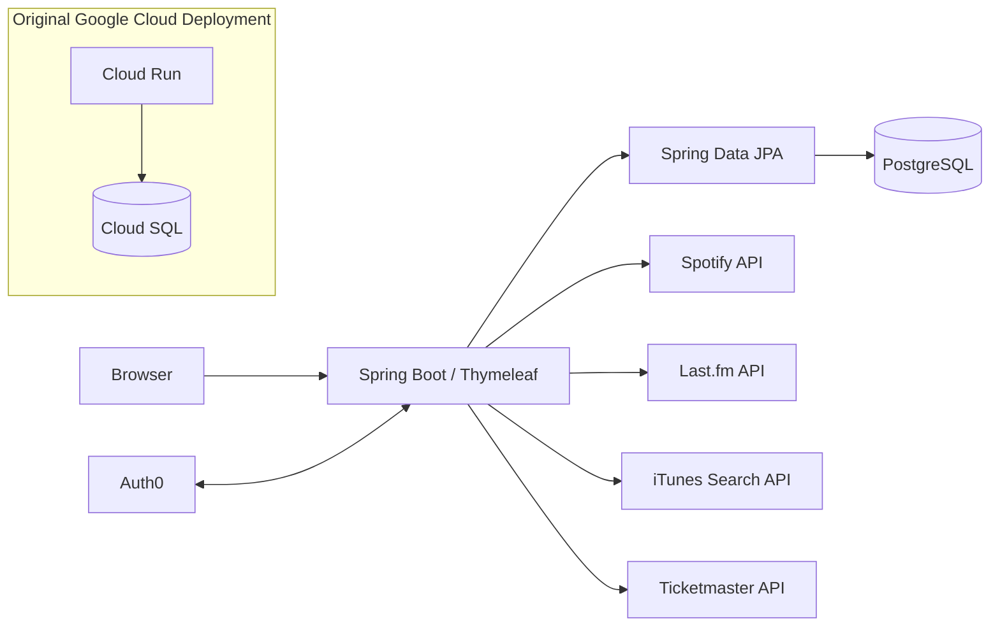

<p align="center">
  
</p>

# MusicBoxd: Final Project @ Makers Academy

**A social music discovery and review platform inspired by Letterboxd, but built for albums, artists and listening habits.**

MusicBoxd was developed as a final group project at Makers Academy. It gives music fans a place to discover music, rate and review albums, build lists, follow friends and bring listening data from multiple music services into one application.

> **Project status:** Archived. The original production infrastructure on Google Cloud was intentionally decommissioned at the end of the Makers Academy project to prevent ongoing cloud costs. The source code remains available for development and portfolio purposes.

## Background

MusicBoxd was created during the Makers Academy final project as a collaborative full-stack application. The goal was to take the familiar social-review concept of Letterboxd and explore what that experience could look like for music through combining reviews, discovery, social activity and real listening data in one place.

The project also provided experience working with a larger shared Java/Spring codebase, relational data modelling, third-party APIs, OAuth authentication, collaborative Git workflows and production deployment to Google Cloud Platform.

## Features

- **Album discovery and search** using iTunes and Last.fm data.
- **Album ratings and reviews**, including review likes and community review pages.
- **Artist and album profiles** enriched with artwork, metadata and external music data.
- **Global Top 40 artists** powered by Last.fm.
- **Daily album suggestions** for music discovery.
- **Spotify integration** for currently playing, recently played, top tracks and top artists.
- **Spotify playback controls** for supported Spotify Premium accounts.
- **30-second track previews** through iTunes where available.
- **Personal profiles** with bios, listening activity and favourite artists/albums.
- **Top 4 favourite albums** and favourite artist tracking.
- **Custom music lists**, including a Want to Listen list.
- **Friends and activity feed** showing recent reviews from connected users.
- **Friend requests and notifications**.
- **Direct messages** between users.
- **Upcoming concerts** for artists through Ticketmaster.
- **Authentication and account management** using Auth0 with Spring Security OAuth2.

## Tech Stack

| Area | Technology |
| --- | --- |
| Language | Java 21 |
| Backend | Spring Boot, Spring MVC |
| Frontend | Thymeleaf, HTML, CSS, JavaScript |
| Security | Spring Security, OAuth2/OIDC, Auth0 |
| Database | PostgreSQL |
| Persistence | Spring Data JPA |
| Migrations | Flyway |
| Testing | JUnit 5, Spring Boot Test, DataJpaTest, H2 |
| Build | Maven |
| Production hosting | Google Cloud Run |
| Production database | Google Cloud SQL for PostgreSQL |
| External APIs | Spotify, Last.fm, iTunes Search API, Ticketmaster |

## Architecture



The production application was deployed to **Google Cloud Run** and connected to **Cloud SQL PostgreSQL** using the Google Cloud SQL socket factory. That infrastructure has since been deliberately removed.

## Project Structure

```text
MusicBoxd/
├── src/
│   ├── main/
│   │   ├── java/com/example/MusicBoxd/
│   │   │   ├── Config/          # Security and application configuration
│   │   │   ├── Controller/      # MVC controllers and routes
│   │   │   ├── Model/           # JPA domain models
│   │   │   ├── Repository/      # Spring Data repositories
│   │   │   ├── api/             # Spotify, Last.fm, iTunes and Ticketmaster clients
│   │   │   └── service/         # Application services
│   │   └── resources/
│   │       ├── db/migration/    # Flyway migrations
│   │       ├── static/          # CSS and image assets
│   │       └── templates/       # Thymeleaf views
│   └── test/                    # Repository, API and application tests
├── docs/                        # Feature and test documentation
├── pom.xml
└── .env.example
```

## Data Model

The application stores users and their social/music activity in PostgreSQL. Core entities include:

- Users
- Artists
- Albums
- Songs
- Reviews
- Likes
- Comments
- Friends
- Messages
- Notifications
- Lists and list items
- Tags
- Favourite albums and artists

Database schema changes are versioned using **Flyway migrations** under `src/main/resources/db/migration`.

## Running Locally

### Prerequisites

You will need:

- Java 21
- PostgreSQL
- API credentials for the external services you want to use
- An Auth0 application for authentication

Maven does not need to be installed globally because the repository includes the Maven wrapper.

### 1. Clone the repository

```bash
git clone https://github.com/alicjakanafa/musicboxd_project.git
cd musicboxd_project/MusicBoxd
```

### 2. Create the local databases

```bash
createdb MusicBoxd
createdb MusicBoxd_Test
```

Flyway will apply the application's migrations when the application starts.

### 3. Configure environment variables

Copy the example environment file:

```bash
cp .env.example .env
```

Then provide your own credentials. The application uses variables including:

```dotenv
PORT=8080

DB_URL=jdbc:postgresql://127.0.0.1:5432/MusicBoxd
TEST_DB_USERNAME=your_postgres_username
TEST_DB_PASSWORD=your_postgres_password

LASTFM_API_KEY=your_lastfm_api_key

SPOTIFY_CLIENT_ID=your_spotify_client_id
SPOTIFY_CLIENT_SECRET=your_spotify_client_secret
SPOTIFY_REDIRECT_URI=http://127.0.0.1:8080/spotify/callback

TICKETMASTER_API_KEY=your_ticketmaster_api_key
TICKETMASTER_API_BASE_URL=https://app.ticketmaster.com/discovery/v2

AUTH0_ISSUER=https://your-auth0-tenant/
AUTH0_CLIENT_ID=your_auth0_client_id
AUTH0_CLIENT_SECRET=your_auth0_client_secret
```

Do not commit `.env` or any real API credentials to source control.

You will also need to configure the appropriate localhost callback and logout URLs in your Auth0 application.

### 4. Start the application

```bash
./mvnw spring-boot:run
```

Then open:

```text
http://localhost:8080
```

## Testing

Run the test suite with:

```bash
./mvnw test
```

The project includes repository tests for the main domain models as well as tests for the iTunes and Last.fm service integrations. Repository tests use an in-memory **H2** database through the `datajpatest` Spring profile.

## External Services

### Last.fm

Used for music discovery and metadata including popular artists, artist information, albums and artwork.

### iTunes Search API

Used for album and song search, album track information and available 30-second audio previews.

### Spotify

Users can connect a Spotify account to surface their listening activity, including recently played music, current playback, top tracks and top artists. Playback controls require a compatible Spotify Premium account.

### Ticketmaster

Used to surface upcoming concert information on artist pages.

### Auth0

Provides OAuth2/OpenID Connect authentication, integrated with Spring Security.

## Original Cloud Deployment

The final project was originally hosted using:

- Google Cloud Run for the Spring Boot application
- Google Cloud SQL for PostgreSQL
- Google Artifact Registry for deployment images
- Google Cloud Build/Cloud Storage resources used during deployment

The cloud environment was intentionally destroyed after the final project concluded, so the original public MusicBoxd URL is no longer available.

## Future Ideas

Although the original deployment is archived, possible areas for further development include:

- Reworking the API integration layer behind dedicated services.
- Expanding automated controller and end-to-end test coverage.
- Adding richer recommendation and discovery features.
- Improving responsive/mobile layouts and accessibility.
- Adding more detailed listening-history visualisations.
- Introducing caching and rate-limit handling for external APIs.
- Re-deploying the application using a smaller personal cloud environment.

## Acknowledgements

Built as a collaborative final project at **Makers Academy**. Many thanks to Erín, Ben, Corban and Charlotte for being great collaborators! Also a massive shoutout to Kerry Finch, our coach at Makers. Her help does not go unnoticed.

Music data and functionality are provided through third-party services including Spotify, Last.fm, Apple/iTunes and Ticketmaster. MusicBoxd is an educational project and is not affiliated with Letterboxd or those services.
